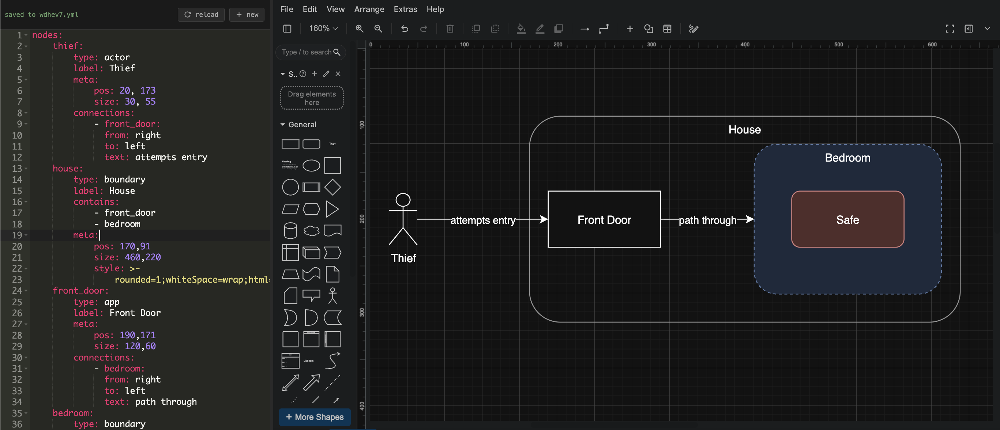

<p align="center"></p>

> *Make every model interactive, declarative, and programmable.*

A bi-directional, dual-representation modeling tool built on `draw.io` and yaml - editing one updates the other in real time. The result is a system model that's as easy to sketch as a whiteboard diagram and as precise as a spec.


<p align="center"></p>

```bash
 ▐▛███▜▌   Claude Code v2.1.76
▝▜█████▛▘  Sonnet 4.6 · Claude Pro
  ▘▘ ▝▝    ~/modeld

❯ ▎ Using the modeld MCP tools, create a minimal house security threat model with these elements:

  ▎ - A Thief (actor) outside the house, attempting entry through the Front Door (app)
  ▎ - A House boundary containing the Front Door and a Bedroom (boundary, trust: high) — the bedroom represents a locked trust zone
  ▎ - A Safe (app, trust: critical) inside the Bedroom, containing the family heirlooms

  ▎ Connections: Thief → Front Door ("attempts entry"), Front Door → Bedroom ("path through").

  ▎ Follow the CLAUDE.md layout guidance to plan coordinates before writing YAML: pick a horizontal flow, compute a shared centre-y so arrows route
  straight, and centre the Safe inside the Bedroom. Use light colours for the Bedroom boundary and a warm pink for the Safe.

⏺ modeld - get_model (MCP)
  ⎿  nodes:
       thief:
         type: actor
     … +52 lines (ctrl+o to expand)

⏺ modeld - get_screenshot (MCP)
  ⎿  <svg xmlns="http://www.w3.org/2000/svg" style="background: transparent; background-color: transparent;" xmlns:xlink="http://www.w3.org/1999/
     xlink" version="1.1" width="1px" height="1px" viewBox="0 0 1 1"><defs/><g><g data-cell-id="0"><g data-cell-id="1"/></g></g></svg>

⏺ Layout plan (horizontal flow, shared centre-y = 200):
  - Thief (30×55): pos 20, 173 → centre-y = 200 ✓
  - Front Door (120×60): pos 130, 170 → centre-y = 200 ✓
  - Bedroom boundary (200×160): pos 350, 120 → centre-y = 200 ✓
  - Safe (120×60): centre inside Bedroom → pos 390, 170 → centre-y = 200 ✓

⏺ modeld - set_model (MCP)(yaml: "nodes:\n  thief:\n    type: actor\n    label: Thief\n    meta:\n      pos: 20, 173\n      size: 30, 55\n
                          connections:\n      - front_door:\n        text: \"attempts entry\"\n        from: right\n        to: left\n\n  house:\n
                          type: boundary\n    label: House\n    contains:\n      - front_door\n      - bedroom\n    meta:\n      pos: 110, 90\n
                          size: 460, 220\n      style: \"rounded=1;whiteSpace=wrap;html=1;fillColor=none;strokeColor=#666666;verticalAlign=top;\"\n\n
                           front_door:\n    type: app\n    label: Front Door\n    meta:\n      pos: 130, 170\n      size: 120, 60\n    connections:\n
                               - bedroom:\n        text: \"path through\"\n        from: right\n        to: left\n\n  bedroom:\n    type: boundary\n
                            label: Bedroom\n    trust: high\n    contains:\n      - safe\n    meta:\n      pos: 350, 120\n      size: 200, 160\n
                          style: \"rounded=1;whiteSpace=wrap;html=1;fillColor=#dae8fc;strokeColor=#6c8ebf;dashed=1;verticalAlign=top;\"\n\n  safe:\n
                            type: app\n    label: Safe\n    trust: critical\n    meta:\n      pos: 390, 170\n      size: 120, 60\n      style:
                          \"rounded=1;whiteSpace=wrap;html=1;fillColor=#f8cecc;strokeColor=#b85450;\"\n")
  ⎿  Model updated.

⏺ modeld - get_screenshot (MCP)
  ⎿  <svg xmlns="http://www.w3.org/2000/svg" style="background: transparent; background-color: transparent;" xmlns:xlink="http://www.w3.org/1999/
     xlink" version="1.1" width="551px" height="221px" viewBox="0 0 551 221"><defs/><g><g data-cell-id="0"><g data-cell-id="1"><g data-cell-id="o
     lWWCZJFiOOGzhHcaFll-1"><g transform="translate(0.5,0.5)"><ellipse cx="15" cy="89.88" rx="7.5" ry="6.875" fill="#ffffff" stroke="#000000" poi
     … +66 lines (ctrl+o to expand)

⏺ The diagram is set and rendering correctly. Here's what was built:

  Layout (horizontal flow, centre-y = 110 in viewport):
  - Thief (actor) sits outside the House boundary, arrow labelled "attempts entry" → Front Door
  - Front Door (app, plain white) sits inside the House; arrow labelled "path through" → Bedroom
  - Bedroom (dashed light-blue boundary, trust: high) contains the Safe
  - Safe (warm pink #f8cecc, trust: critical) is centred inside the Bedroom — holds the family heirlooms

  Both arrows route straight (all nodes share centre-y = 110), the Safe is horizontally centred inside the Bedroom, and there's ≥20px padding
  throughout.
```

---

## Why

Models represent a single view of a system at a point in time. They might not capture every detail, but they communicate the right level of abstraction for a given moment. The problem is that visual and written representations have always lived apart:

- **Drawing is fast, but loses precision.** A sketch communicates structure instantly, but converting it to interface definitions or system requirements requires manual follow-up work.
- **Code is precise, but loses the big picture.** Documentation tells you the details; it rarely gives a newcomer a whole-system view of how components fit together.
- **Diagrams don't version well.** Finding who changed something, or why, is either impossible or requires reaching out to people directly.

modeld solves all three by treating the diagram and the code as two views of the same artifact. Changes propagate in both directions, and the underlying text is version-controlled like any other source file.

## Really, why?

Threat Modelling had a real moment there, model-as-code never took off and I wanted to learn more about a bit of software I'd used a lot to run sessions: Draw.io. It's cool, surprisingly extensible, and I thought it'd be great to be able to type out a model faster than dragging boxes around. Lately, I was playing with MCPs for diagramming tools and thought it would be fun to throw a streamble HTTP server ontop of the YAML editor and see how far it could go!

I set out to make swimlanes.io for Threat Modelling, thanks for the inspiration. Ultimately this is a bad idea of a project to build though - WYSIWYG editors have lots of internal state and props that are difficult to express in markup - trying to keep them in sync requires implementing in both directions (which I got around with the `meta` block, and keeping the internal draw.io `style` string as-is). Regardless of much effort to harden this translation layer between the two representations, it's still pretty buggy - so there's a "Reload" button which re-draws the graphical version based on reliable edits made to the YAML (DSL validated)


---

## Features

- **Bidirectional sync** — add a node to the diagram and the code updates; edit the code and the diagram reflects it.
- **Declarative model format** — models are defined in a plain-text YAML syntax that's readable, diffable, and scriptable.
- **MCP integration** — an included Model Context Protocol server exposes the model to Claude Code for AI-assisted editing and querying.

---

## Getting Started

**Clone draw.io** (required — the diagramming UI is served from a local draw.io checkout):

```bash
git clone https://github.com/jgraph/drawio.git drawio
```

**Install dependencies:**

```bash
npm install
```

**Build:**

```bash
npm run build
```

**Run:**

```bash
npm start
```

Then open [http://localhost:3001](http://localhost:3001) in your browser.

**Run tests:**

```bash
npm test
```

---

## Docker

**Build the image:**

```bash
docker build -t modeld .
```

**Run with default (empty) model:**

```bash
docker run -d -p 3001:3001 modeld
```

**Run with your own `model.yaml`** (bind-mount it so changes persist and the file is editable from the host):

```bash
docker run -d -p 3001:3001 -v "$(pwd)/model.yaml:/app/model.yaml" modeld
```

> Note: do not use `VOLUME` mounts for `model.yaml` — Docker volumes work as directories, not files, and will conflict with the file path.

Then open [http://localhost:3001](http://localhost:3001) in your browser.

---

## MCP Setup

Start the MCP server:

```bash
node mcp/server.js
```

Register it with Claude Code:

```bash
claude mcp add --transport http modeld http://localhost:3001/mcp
```
